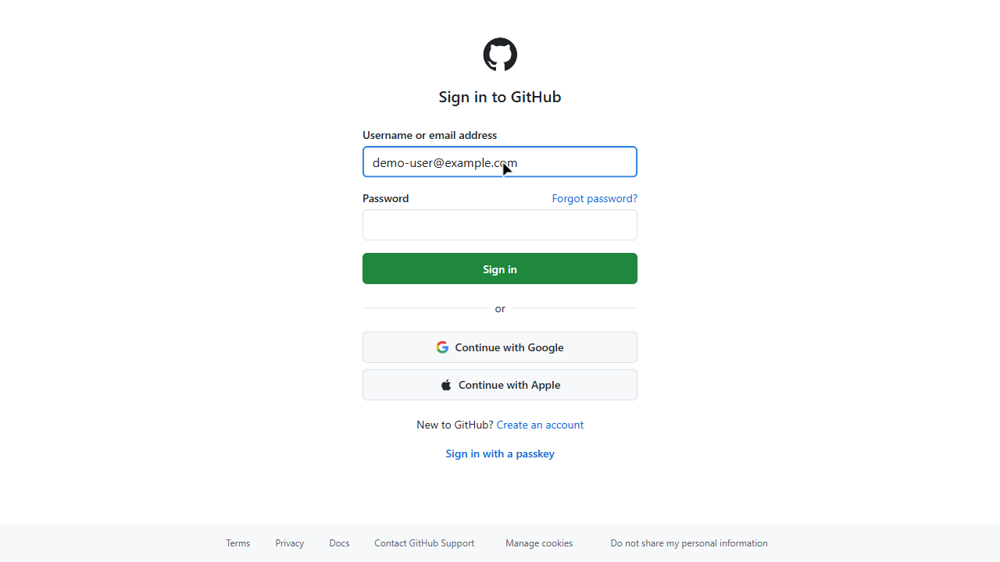
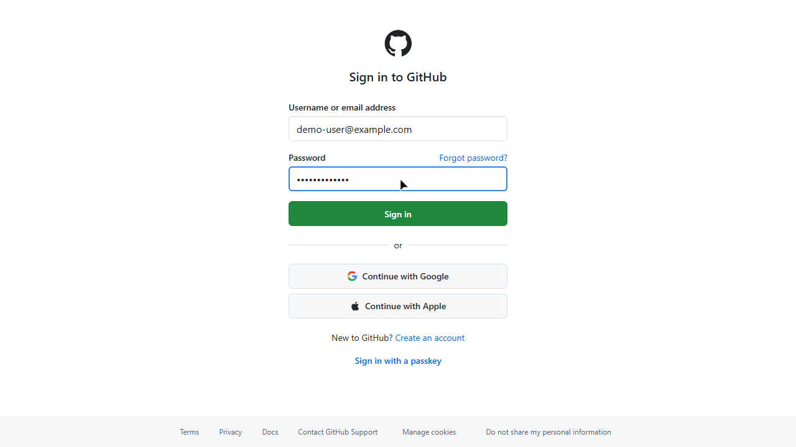
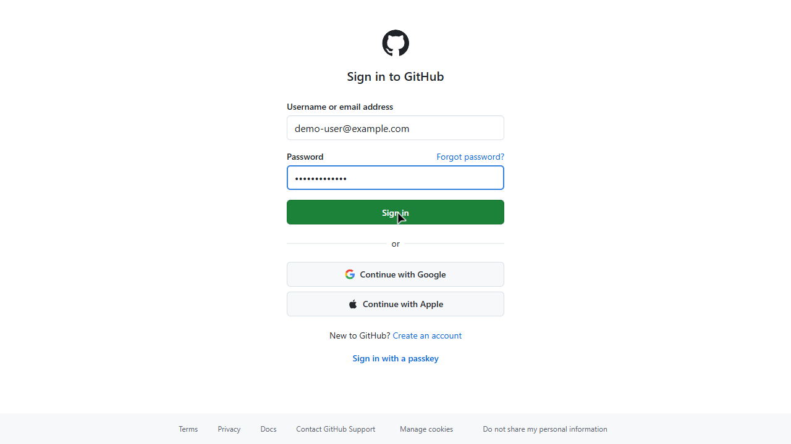
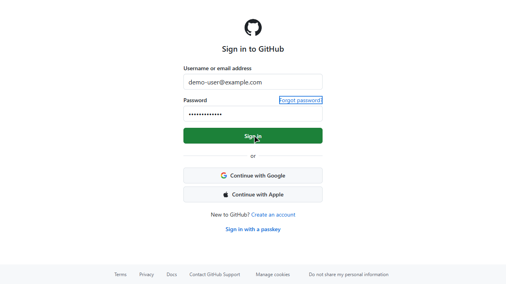

# GitHub Login Demo

## 概览

- **起始 URL**: https://github.com/login
- **总步骤数**: 8
- **成功率**: 100%
- **总耗时**: 4.0 秒

## 操作步骤

### 步骤 1: Open GitHub login page

- **URL**: https://github.com/login
- **状态**: ✅ 成功
- **耗时**: 500ms

### 步骤 2: Enter username or email address

- **输入值**: `demo-user@example.com`
- **状态**: ✅ 成功
- **耗时**: 500ms

### 步骤 3: Enter password

- **输入值**: `••••••••••••`
- **状态**: ✅ 成功
- **耗时**: 500ms

### 步骤 4: Hover over Sign in button

- **状态**: ✅ 成功
- **耗时**: 500ms

### 步骤 5: Login form filled and ready to submit

- **状态**: ✅ 成功
- **耗时**: 500ms

### 步骤 6: Scroll down to see more options

- **状态**: ✅ 成功
- **耗时**: 500ms

### 步骤 7: Press Tab to navigate

- **状态**: ✅ 成功
- **耗时**: 500ms

### 步骤 8: Verify GitHub login page

- **状态**: ✅ 成功
- **耗时**: 500ms

---
*本文档由 demosmith 自动生成于 2026-01-29T12:41:24.275Z*